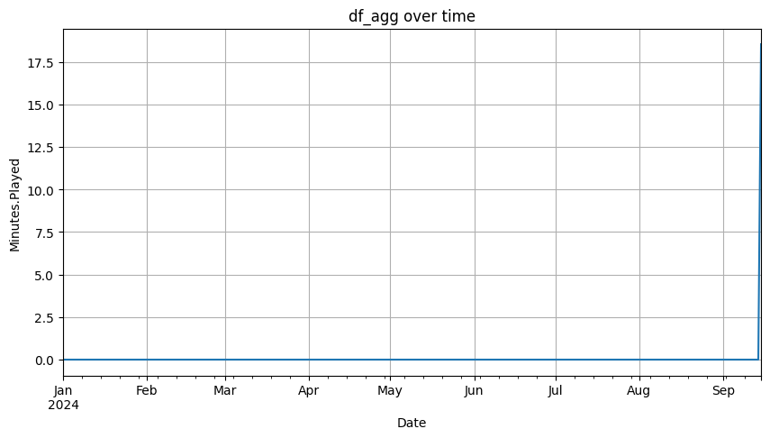

# Spotify Wrapped 2024 Analysis

This project analyzes personal Spotify streaming data to verify the accuracy of Spotify Wrapped and perform a deeper analysis of listening habits.

## Project Structure

```
spotify-wrapped-analysis/
├── data/
│   └── Spotify_Streaming_History_Audio_Data_2024.json
├── notebooks/
│   └── spotify_wrapped_eda.ipynb
└── README.md
```

## Requirements

- Python 3.8+
- pandas
- plotly
- jupyter

## Usage

1. Clone the repository
2. Place your Spotify data in the `data/` folder
3. Run the notebook to perform your own analysis

## Motivation

After not receiving a complete Spotify Wrapped for 2024 due to insufficient listening activity, this project aims to:

- Understand the minimum listening threshold required for Spotify Wrapped
- Analyze my limited listening patterns
- Verify why Spotify couldn't generate a complete Wrapped experience
- Examine the actual amount of music streamed throughout the year

## Expectations vs Reality

Initial expectations were focused on verifying Wrapped accuracy, but the analysis revealed:

1. Insufficient data to generate meaningful top artist rankings
2. Limited song play counts throughout the year
3. Inconsistent listening patterns with large gaps
4. Data volume below Spotify's threshold for generating a complete Wrapped
5. Sporadic listening trends that don't form clear monthly patterns

## Data

Data is obtained directly from Spotify through the "Download my data" option in privacy settings:

1. Go to Spotify settings page
2. Navigate to privacy section
3. Select "Download my information"
4. Choose only "Streaming History" to get relevant data
5. Wait for the download link email
6. Download and use it

##  Analyze the Data

Follow the notebook to see my research

## Conclusions

The analysis revealed why Spotify couldn't generate a complete Wrapped experience for my account:

1. **Limited Listening Activity**: The data shows inconsistent and sparse listening patterns throughout 2024
2. **Data Volume**: The total amount of streamed content was below Spotify's threshold for generating comprehensive statistics
3. **Irregular Patterns**: The listening data shows sporadic usage rather than consistent engagement
4. **Insufficient Sample Size**: The limited data makes it difficult to draw meaningful conclusions about favorite artists or songs
5. **Platform Requirements**: This analysis helps understand Spotify's minimum activity requirements for generating a complete Wrapped experience

### Interesting Finding: Lenny Kravitz Spike

Despite the overall limited listening activity, an interesting pattern emerged in the data: a significant spike in Lenny Kravitz streams. This peak in listening activity was directly related to an upcoming concert at Movistar Arena in Buenos Aires, Argentina, scheduled for November 28th. The data shows increased engagement with his music as the concert date approached, demonstrating how real-world events influence listening habits.



This finding illustrates that while overall yearly listening was limited, specific events can drive focused listening periods for particular artists.

This project shifted from verifying Wrapped accuracy to understanding the minimum engagement threshold needed for Spotify's year-end analysis, providing insights into the platform's data aggregation requirements and how personal events influence music consumption patterns.


